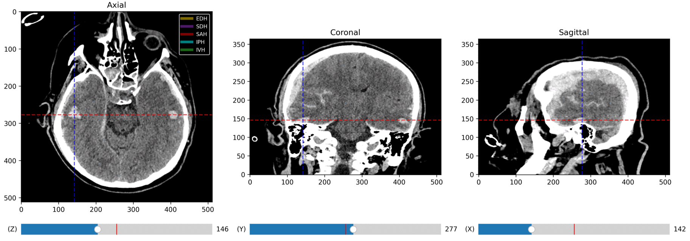
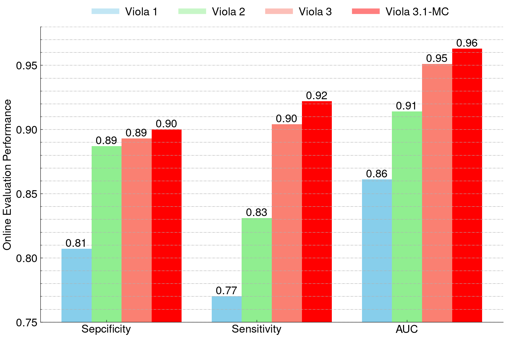

# Viola-Unet V3.1
[Viola-Unet](https://arxiv.org/abs/2208.06313) is the winning solution for the validation dataset in the 2022 Intracranial Hemorrhage Segmentation challenge ([INSTANCE 2022](https://instance.grand-challenge.org/)). 
This powerful AI model is designed for automated segmentation of intracranial hemorrhages (ICH) in head CT scans. In this release, we retrained Viola-Unet with additional data and enhanced the architecture for improved multi-class segmentation performance.
We are excited to release Viola-Unet v3.1, our latest multi-class model, now available to academic users for non-commercial research and development.

## 🖥️ Try Our Latest Model with a New GUI (Windows & macOS)

### ▶️ Download & Run Viola-GUI v3.1
1. **Download** the all-in-one standalone app:  
   🔗 [Viola-GUI Version 3.1](https://www.youtube.com/watch?v=Y6lVQpNrHCk) (`~2.9 GB`)
2. **Double-click** the downloaded `.exe` (Windows) or `.app` (macOS).  
   If prompted by the system, choose **“Run anyway”** or **“Open”**.
3. **Wait briefly** for initialization — the app will launch automatically.
4. Works on both **GPU-enabled** and **non-GPU systems**.
5. No installation needed. To uninstall, simply delete the file.

> 🛟 For questions or issues, feel free to [contact us](mailto:samleoqh@gmail.com).

---

<p align="center">
  
  
</p>

---

## 🧪 Run Pretrained Models (v2) in Docker *(v3.1 Docker coming soon)*

### 🔽 1. Download Docker Image
- [viola_v2.tar.gz (Docker Image)](https://e.pcloud.link/publink/show?code=XZID5MZvtia7EGYQypb0JDLiVu71p4kK4vy)

### 🗂️ 2. Prepare Input/Output Folders
- **Input folder**: Place CT scans for testing  
  Example: `/home/yourname/Desktop/input`
- **Output folder**: Create an empty folder for results  
  Example: `/home/yourname/Desktop/predict`

### 🐳 3. Run via Terminal (Linux)
```bash
docker load < viola_v2.tar.gz
docker run --gpus "device=0" --name viola -e PYTHONUNBUFFERED=1 -v /home/yourname/Desktop/input:/input -v /home/yourname/Desktop/predict:/predict viola_v2:latest
```
The program will: 
1. Read each CT file (```*.nii.gz``` or ```*.nii``` in the input folder.
2. Use pre-trained models (ensemble of Viola_Unet and nnU-Net) to segment possible ICH from the CT scans.
3. Save the segmented masks to the output folder (with exactly the same name as input file)
4. Output inference messages to the terminal and save all messages to ```prediction_info.csv```.
Example inference message:
```
model nnUNet loaded successfully!
model Viola_s loaded successfully!

---------------start predicting input file: 002.nii.gz - 1/2 ----------------
Predicted lesion volume : 6.282 ml
Segmention was saved to file: 002.nii.gz
Cost time: 2.269 sec

---------------start predicting input file: 003.nii.gz - 2/2 ----------------
Predicted lesion volume : 0.428 ml
Segmentation was saved to the file: 003.nii.gz
Cost time: 2.335 sec

-------------------------Completed--------------------------------------------------
Predictions infor is saved to predictions_info.csv
```
## Running Inference on CPU and Windows OS
1. Load the Docker image:
```
docker load -i viola_v2.tar.gz
```
2. Run the inference with the following command:
```
docker run --name viola -v D:\data\CT\test\input\:/input -v D:\data\CT\test\predict\:/predict viola_v2:latest
```

### Folder Structure:
```
├── /home/yourname/Desktop/input
          ├── 144.nii.gz
          ├── 145.nii.gz
          ├── 146.nii.gz

├── /home/yourname/Desktop/predict
          ├── 144.nii.gz
          ├── 145.nii.gz
          ├── 146.nii.gz
          ├── predictions_info.csv
          
```

## Citation: 
Please consider citing [our work](https://arxiv.org/abs/2208.06313) if you find the code helps you

```
@inproceedings{liu2023ICH,
  title={Voxels Intersecting along Orthogonal Levels Attention U-Net for Intracerebral Haemorrhage Segmentation in Head CT},
  author={Qinghui Liu and Bradley J MacIntosh and Till Schellhorn and Karoline Skogen and KyrreEeg Emblem and Atle Bjørnerud},
  booktitle={Proceedings of ISBI 2023 IEEE 20th International Symposium on Biomedical Imaging (ISBI)},
  year={2023}
}

@article{macintosh2023radiological,
  title={Radiological features of brain hemorrhage through automated segmentation from computed tomography in stroke and traumatic brain injury},
  author={MacIntosh, Bradley J and Liu, Qinghui and Schellhorn, Till and Beyer, Mona K and Groote, Inge Rasmus and Morberg, P{\aa}l C and Poulin, Joshua M and Selseth, Maiken N and Bakke, Ragnhild C and Naqvi, Aina and others},
  journal={Frontiers in Neurology},
  volume={14},
  pages={1244672},
  year={2023},
  publisher={Frontiers Media SA}
}

@article{liu2025examining,
  title={Examining Deployment and Refinement of the VIOLA-AI Intracranial Hemorrhage Model Using an Interactive NeoMedSys Platform},
  author={Liu, Qinghui and Nesvold, Jon and Raaum, Hanna and Murugesu, Elakkyen and R{\o}vang, Martin and Maclntosh, Bradley J and Bj{\o}rnerud, Atle and Skogen, Karoline},
  journal={arXiv preprint arXiv:2505.09380},
  year={2025}
}
```
---

## 🙏 Acknowledgements

We would like to thank the following contributors and resources that made this project possible:

- **[INSTANCE Challenge 2022](https://instance.grand-challenge.org/)**: For providing the Intracranial Hemorrhage Segmentation dataset used to train and evaluate our models.
- **[BHSD Dataset](https://github.com/White65534/BHSD)**: For providing additional annotated data that helped improve model generalization.
- **[nnU-Net Framework](https://github.com/MIC-DKFZ/nnUNet)**: For providing a robust baseline and automation framework for medical image segmentation.
- **[MONAI (Medical Open Network for AI)](https://monai.io/)**: For offering powerful tools and utilities for deep learning in medical imaging.

Special thanks to the open-source community for their continuous contributions to medical AI research.

---
