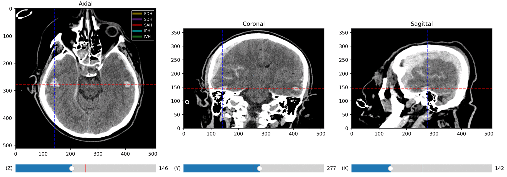
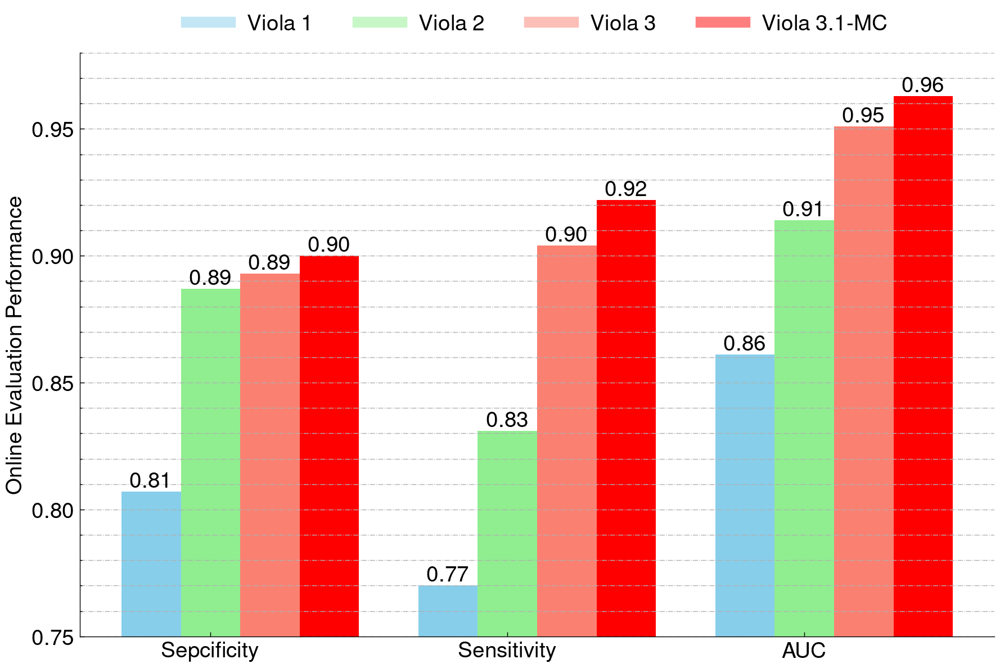

# Violai V3.1
[Viola-Unet](https://arxiv.org/abs/2208.06313) is the winning solution for the validation dataset in the 2022 Intracranial Hemorrhage Segmentation challenge ([INSTANCE 2022](https://instance.grand-challenge.org/)). It is a state-of-the-art deep learning model designed for automated segmentation of intracranial hemorrhage (ICH) on head CT scans.

Violai v3.1 builds on this foundation with:
- Retrained Viola-Unet models using an expanded and more diverse dataset
- Architecture enhancements for improved multi-class ICH segmentation
- A production-ready environment for research, experimentation, and clinical-workflow prototyping

## ⚖️ Licensing

This project uses **dual licensing** to respect the open-source dependencies and the non-commercial dataset agreements:

| Component | License | Permitted Use |
|-----------|---------|---------------|
| **Source code** | [Apache 2.0](LICENSE) | Research, education, and commercial use* |
| **Pre-trained weights & Docker images** | [CC BY-NC-ND 4.0](MODEL_LICENSE.md) | **Academic and non-commercial research only** |

Violai v3.1 provides pre-trained ViolaNet models capable of comprehensive ICH analysis, including subtype classification across EDH, SDH, SAH, IPH, and IVH. The system uses an ensemble of five specialized 3D convolutional neural networks, each trained on heterogeneous medical imaging cohorts, to deliver robust hemorrhage detection and high-fidelity volumetric analysis.

## Key Features
- 🧠 **Multi-model Ensemble**: 5 pre-trained ViolaNet variants for comprehensive ICH analysis
- 🩺 **Subtype Classification**: Differentiates between 5 ICH subtypes with volumetric measurements
- 📊 **Detailed Metrics**: Outputs probability scores, volumetric measurements (ml), and segmentation masks
- 🖥️ **Hardware Optimized**: Automatic detection and utilization of CUDA, MPS (Apple Silicon), or CPU
- 🐳 **Containerized**: Ready-to-use Docker image with all dependencies pre-installed
- 📈 **Batch Processing**: Efficient processing of large NIfTI datasets with configurable batch sizes
- 🔄 **Memory Efficient**: Aggressive memory management for stable long-running inference

## Medical Context
Intracranial hemorrhage (ICH) refers to bleeding within the skull. This tool detects and classifies:
- **EDH**: Epidural hematoma (between skull and dura)
- **SDH**: Subdural hematoma (between dura and arachnoid)
- **SAH**: Subarachnoid hemorrhage (between arachnoid and pia)
- **IPH**: Intraparenchymal hemorrhage (within brain tissue)
- **IVH**: Intraventricular hemorrhage (within brain ventricles)

## Models Overview

| Model | Architecture | Input Channels | Classes | Purpose |
|-------|--------------|----------------|---------|---------|
| model1 | DynUNet (ViolaUNet) | 3 | 2 | Base ICH detection |
| model2 | PlainViolaConvUNet | 1 | 2 | Specialized hemorrhage detection |
| model3 | ResidualEncoderUNet | 1 | 6 | Multi-class subtype segmentation |
| model4 | PlainViolaConvUNet | 3 | 2 | RL-enhanced variant 0 |
| model5 | PlainViolaConvUNet | 3 | 2 | RL-enhanced variant 1 |

## 🖥️ Try Our Latest Model with a New GUI (Windows & macOS)

### ▶️ Download & Run Viola-GUI v3.1
1. **Download** the all-in-one standalone app:  
   🔗 [Viola-GUI Version 3.1](https://www.youtube.com/watch?v=Y6lVQpNrHCk) (`~2.9 GB` for [Windows](https://e.pcloud.link/publink/show?code=XZCrStZ2cViUi6FSNzJsLDOy1W3XmaVaIFk), `~0.5 GB` for [macOS](https://e.pcloud.link/publink/show?code=XZxrStZ987f4mhOu6VIxtiaxxK7xzfYkhpV))
2. **Double-click** the downloaded `.exe` (Windows) or `.app` (macOS).  
   If prompted by the system, choose **“Run anyway”** or Go to `System Settings - Privacy and Security`, at the bottom, click `"Open Anyway"`.
3. **Wait briefly** for initialization — the app will launch automatically.
4. Works on both **GPU-enabled** and **non-GPU systems**.
5. No installation needed. To uninstall, simply delete the file.

https://github.com/user-attachments/assets/af16a489-703d-45fa-90ca-269f97e2c0f1


> 🛟 For questions or issues, feel free to [contact us](mailto:samleoqh@gmail.com).

---

<p align="left">
  
  
</p>

---

## 🧪 Run Violai v3.1 in Docker

### 🔽 1. Download Docker Image
- [violai-3-1.tar.gz (Docker Image)](https://e.pcloud.link/publink/show?code=XZKnUAZc8peY7pY16jtikDqqmIR6uzaOmI7)

### 🗂️ 2. Prepare Input/Output Folders
- **Input folder**: Place CT scans for testing  
  Example: `/home/yourname/Desktop/input`
- **Output folder**: Create an empty folder for results  
  Example: `/home/yourname/Desktop/predict`

### 🐳 3. Run via Terminal (Linux)
```bash
docker load < violai-3-1.tar.gz
docker run --gpus "device=0" --name violai -e PYTHONUNBUFFERED=1 -v /home/yourname/Desktop/input:/input -v /home/yourname/Desktop/predict:/predict violai:3.1
```
The program will: 
1. Read each CT file (```*.nii.gz``` or ```*.nii``` in the input folder.
2. Use pre-trained 5 models to segment 5 ICH subtypes (```EDH:1, SDH:2, SAH:3, IPH:4, IVH:5```) from the CT scans.
3. Save the segmented masks to the output folder (with exactly the same name as input file)
4. Output detailed volumetric analysis, class probabilities and predicted labels to ```predictions_viola3-1.csv```.

## Running Inference on CPU and Windows OS
1. Load the Docker image:
```
docker load -i violai-3-1.tar.gz
```
2. Run the inference with the following command:
```
docker run --name violai -v D:\data\CT\test\input\:/input -v D:\data\CT\test\predict\:/predict violai:3.1
```

### Output Folder Structure:
```
├── /home/yourname/Desktop/input
   ├── case1.nii.gz
   ├── case2.nii.gz
   └── ...

├── /home/yourname/Desktop/predict/predictions_violai_3_1_YYYY-MM-DD-HH-MM-SS/
   ├── predictions_viola3-1.csv          # Comprehensive results CSV
   ├── case1.nii.gz                      # Segmentation mask, the filenames same as the inputs
   ├── case2.nii.gz
   └── ...
          
```

### CSV Output Format
The CSV file contains the following columns:
- `File_Name`: Original NIfTI filename
- `Pixdim_max`: Maximum pixel dimension (mm)
- `Prob_1ml_bleed`: Probability of ≥1ml hemorrhage
- `Prob_any_ICH`: Probability of any ICH present
- `Prob_EDH`, `Prob_SDH`, `Prob_SAH`, `Prob_IPH`, `Prob_IVH`: Subtype probabilities
- `EDH_volume`, `SDH_volume`, `SAH_volume`, `IPH_volume`, `IVH_volume`: Subtype volumes (ml)
- `Total_volume`: Total hemorrhage volume (ml)
- `Pred_labels`: Detected label indices (0=background, 1-5=ICH subtypes)
## Citation: 
Please consider citing [our work](https://arxiv.org/abs/2208.06313) if you find the code helps you

```
@inproceedings{liu2023ICH,
  title={Voxels Intersecting along Orthogonal Levels Attention U-Net for Intracerebral Haemorrhage Segmentation in Head CT},
  author={Qinghui Liu and Bradley J MacIntosh and Till Schellhorn and Karoline Skogen and KyrreEeg Emblem and Atle Bjørnerud},
  booktitle={Proceedings of ISBI 2023 IEEE 20th International Symposium on Biomedical Imaging (ISBI)},
  year={2023}
}

@article{macintosh2023radiological,
  title={Radiological features of brain hemorrhage through automated segmentation from computed tomography in stroke and traumatic brain injury},
  author={MacIntosh, Bradley J and Liu, Qinghui and Schellhorn, Till and Beyer, Mona K and Groote, Inge Rasmus and Morberg, P{\aa}l C and Poulin, Joshua M and Selseth, Maiken N and Bakke, Ragnhild C and Naqvi, Aina and others},
  journal={Frontiers in Neurology},
  volume={14},
  pages={1244672},
  year={2023},
  publisher={Frontiers Media SA}
}

@article{liu2025examining,
  title={Examining Deployment and Refinement of the VIOLA-AI Intracranial Hemorrhage Model Using an Interactive NeoMedSys Platform},
  author={Liu, Qinghui and Nesvold, Jon and Raaum, Hanna and Murugesu, Elakkyen and R{\o}vang, Martin and Maclntosh, Bradley J and Bj{\o}rnerud, Atle and Skogen, Karoline},
  journal={arXiv preprint arXiv:2505.09380},
  year={2025}
}
```
---


## 🙏 Acknowledgements

We would like to thank the following contributors and resources that made this project possible:

- **[INSTANCE Challenge 2022](https://instance.grand-challenge.org/)**: For providing the Intracranial Hemorrhage Segmentation dataset used to train and evaluate our models.
- **[BHSD Dataset](https://github.com/White65534/BHSD)**: For providing additional annotated data that helped improve model generalization.
- **[nnU-Net Framework](https://github.com/MIC-DKFZ/nnUNet)**: For providing a robust baseline and automation framework for medical image segmentation.
- **[MONAI (Medical Open Network for AI)](https://monai.io/)**: For offering powerful tools and utilities for deep learning in medical imaging.

Special thanks to the open-source community for their continuous contributions to medical AI research.

---
